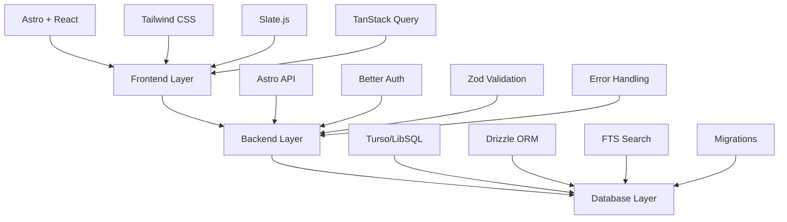

# Architecture Overview

ArcAide is built as a modern full-stack web application with server-side rendering capabilities. This document provides a high-level overview of the system architecture and guides you to detailed documentation for each area.

## Quick Navigation

- [Technology Stack](./technology-stack) - Frontend, backend, and tooling choices
- [Domain Models](./domain-models) - Core business logic and data structures
- [Database Design](./database-design) - Schema, relationships, and patterns
- [Component Architecture](./component-architecture) - Frontend structure and patterns
- [State Management](./state-management) - Data flow and state patterns
- [Security Model](./security-model) - Authentication, authorization, and protection
- [Performance](./performance) - Optimization strategies and considerations
- [Development Patterns](./development-patterns) - Code organization and best practices
- [Theme System](./theme-system) - D&D-inspired design and styling
- [File Organization](./file-organization) - Project structure and conventions

## System Overview

:::note[Architecture Philosophy]
ArcAide is designed as a campaign management tool for tabletop RPG game masters, built with modern web technologies and following established architectural patterns.
:::

### Key Architectural Principles

1. **Type Safety First** - TypeScript throughout the entire stack
2. **Component-Based Architecture** - Modular, reusable components
3. **Server-Side Rendering** - Performance and SEO optimization
4. **Progressive Enhancement** - Works without JavaScript, enhanced with it
5. **Domain-Driven Design** - Clear separation of business logic
6. **Security by Default** - Authentication and authorization built-in

### High-Level Architecture

:::tip[Architecture Benefits]
This layered architecture provides excellent separation of concerns, making the codebase maintainable and scalable.
:::

### Core Features

:::note[Feature Overview]
ArcAide provides a comprehensive set of tools for D&D campaign management with a focus on structured storytelling.
:::

- **Campaign Management** - Create and organize RPG campaigns
- **Arc System** - Structured storytelling framework
- **Entity Management** - NPCs, locations, items, and plot devices
- **Search Functionality** - Full-text search across all content
- **Rich Text Editing** - Slate.js-powered content creation
- **Internal Linking** - Wiki-style cross-references between content
- **View/Edit Modes** - Dual interface for creation and presentation

## Getting Started

:::tip[New to the Codebase?]
If you're new to the codebase, we recommend following this learning path for the best understanding of the system.
:::

For detailed information on each architectural component, please refer to the specific sections linked above. If you're new to the codebase, we recommend starting with:

1. [Technology Stack](./technology-stack) - Understand the tools and frameworks
2. [Domain Models](./domain-models) - Learn the core business concepts
3. [Component Architecture](./component-architecture) - Understand the frontend structure
4. [Development Patterns](./development-patterns) - Learn coding conventions
